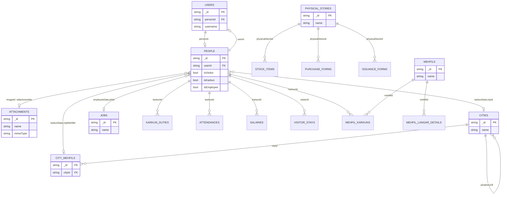
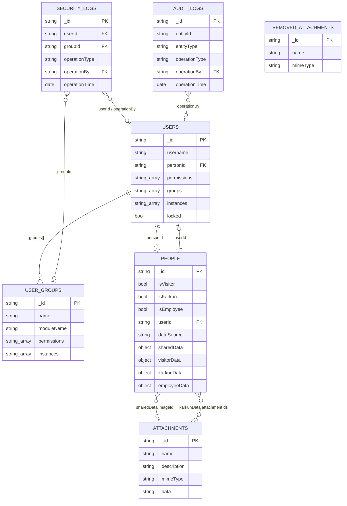
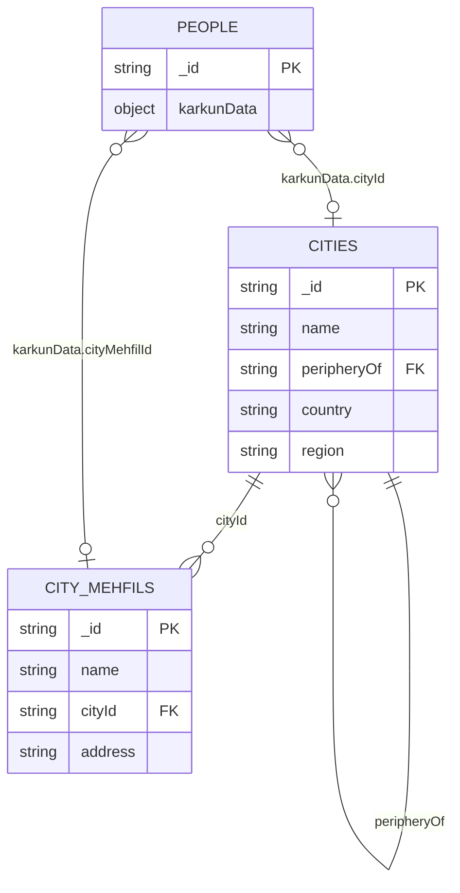
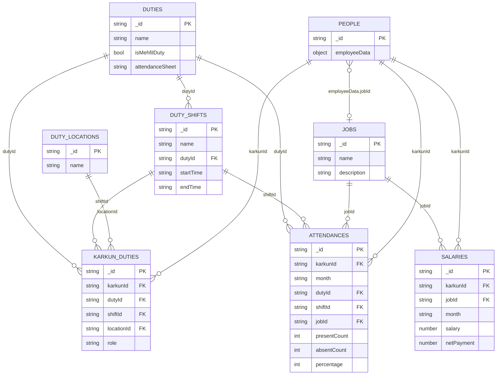
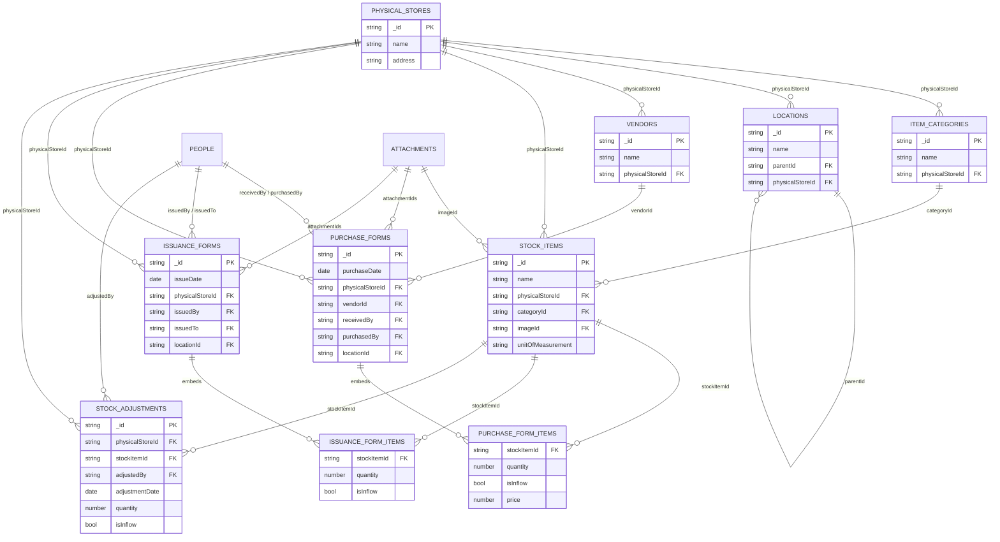
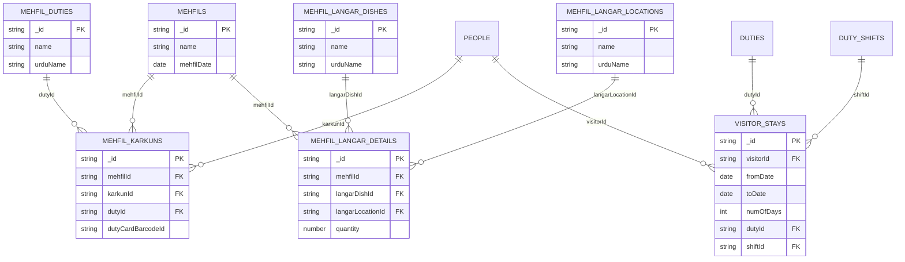

# MongoDB ER Diagram

Logical entity-relationship view of the MongoDB collections used by Idreesia ERP.

Sources: `idreesia-common/server/collections/**`, `idreesia-common/server/schemas/**`, and migrations under `idreesia-web/imports/startup/server/migrations/`.

MongoDB is document-oriented (no enforced FKs). Relationships below are application-level: fields named `*Id` / `*Ids[]` reference other documents’ `_id`.

## Conventions

| Convention | Meaning |
|---|---|
| `*Id` | Single FK to another collection’s `_id` |
| `*Ids[]` | Array of FKs |
| `karkunId` / `visitorId` / inventory person fields | Point to **`common-people`** after migration 39 |
| Audit fields | Most docs include `createdAt` / `createdBy` / `updatedAt` / `updatedBy` |
| Approvable docs | Also include `approvedOn` / `approvedBy` |

## Overview (active domains)

---

## Common & Admin

### People model

One collection (`common-people`) holds visitors, karkuns, and employees:

| Flag | Nested document | Used by |
|---|---|---|
| `isVisitor` | `visitorData` | Security |
| `isKarkun` | `karkunData` | HR / outstation |
| `isEmployee` | `employeeData` | HR employees / salaries |

GraphQL still exposes Karkun/Visitor shapes via mappers (`personToKarkun`, `personToVisitor`). Legacy collections `hr-karkuns` and `security-visitors` remain registered but are not the active write path.

### Attachments

- Active blobs: `common-attachments`
- Soft-deleted: `common-removed-attachments`
- Parents store `attachmentIds[]` and/or `imageId` — no reverse FK on attachments

---

## Outstation

---

## HR

---

## Inventory

Line items on purchase/issuance forms are **embedded arrays** (`items[]`), not separate collections. They are shown as entities only to clarify the stock-item relationship.

`inventory-item-types` still exists in code as a legacy catalog (merged into stock items historically).

---

## Security

---

## Collection name map (active)

| Domain | Mongo collection | Code export |
|---|---|---|
| Admin | `users` | `Users` (Meteor.users) |
| Admin | `user-groups` | `UserGroups` |
| Common | `common-people` | `People` |
| Common | `common-attachments` | `Attachments` |
| Common | `common-removed-attachments` | `RemovedAttachments` |
| Common | `common-audit-log` | `AuditLogs` |
| Common | `common-security-log` | `SecurityLogs` |
| Outstation | `outstation-cities` | `Cities` |
| Outstation | `outstation-city-mehfils` | `CityMehfils` |
| HR | `hr-jobs` | `Jobs` |
| HR | `hr-duties` | `Duties` |
| HR | `hr-duty-shifts` | `DutyShifts` |
| HR | `hr-duty-locations` | `DutyLocations` |
| HR | `hr-karkun-duties` | `KarkunDuties` |
| HR | `hr-attendances` | `Attendances` |
| HR | `hr-salaries` | `Salaries` |
| Inventory | `inventory-physical-stores` | `PhysicalStores` |
| Inventory | `inventory-item-categories` | `ItemCategories` |
| Inventory | `inventory-locations` | `Locations` |
| Inventory | `inventory-vendors` | `Vendors` |
| Inventory | `inventory-stock-items` | `StockItems` |
| Inventory | `inventory-purchase-forms` | `PurchaseForms` |
| Inventory | `inventory-issuance-forms` | `IssuanceForms` |
| Inventory | `inventory-stock-adjustments` | `StockAdjustments` |
| Security | `security-mehfils` | `Mehfils` |
| Security | `security-mehfil-duties` | `MehfilDuties` |
| Security | `security-mehfil-karkuns` | `MehfilKarkuns` |
| Security | `security-mehfil-langar-dishes` | `MehfilLangarDishes` |
| Security | `security-mehfil-langar-locations` | `MehfilLangarLocations` |
| Security | `security-mehfil-langar-details` | `MehfilLangarDetails` |
| Security | `security-visitor-stays` | `VisitorStays` |

---

## Dropped / inactive (not in diagrams)

Collection classes may still exist in the repo, but these were removed from the database (or are unused):

| Status | Collections |
|---|---|
| Dropped — migration 42/43 | Accounts (`accounts-*` heads, vouchers, payments, companies, …) |
| Dropped — migration 43 | `portals` |
| Dropped — migration 44 | Imdad (`imdad-*`), wazaif-management collections |
| Code only / unwired | `communication-messages` |
| Legacy leftovers | `hr-karkuns`, `security-visitors`, `security-visitor-mulakaats`, `inventory-item-types` |

---

## Rendering

GitHub and most Markdown previewers render the Mermaid blocks above. For a single printable chart, start with **Overview**, then open the domain section you need.
