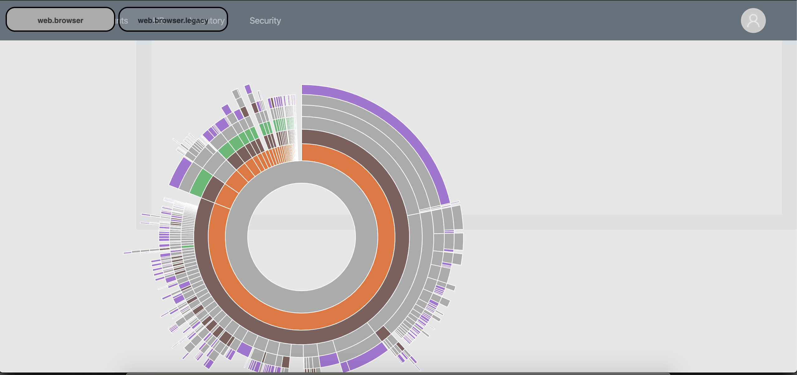

# Bundle Size
Run `meteor yarn visualize` in the idreesia-web folder to inspect the bundle contents for the web app.



The meteor compiler at the moment unfortunately does not do tree shaking when building the app. This means that larger libraries get included completely resulting in the bloating of the final built package. So in order to reduce the size of the final package, individual components from libraies like Antd and lodash are referenced in the application.

## Referencing Antd Components
All antd components being used by the application (along with their styles) are referenced in the file `imports/controls/index.js`. The application components can then reference the antd components that they use from this file instead of directly importing them from the antd package. So for instance 

```
import { Table } from '/imports/controls';
```

instead of doing

```
import { Table } from 'antd';
```

## Referencing Lodash functions
A similar approach has been taken for lodash. All the functions that we are using from lodash have been exported from `utilities/lodash.js` in the `idreesia-common` package. And wherever they are required we import them from here instead of directly referencing the lodash package. So for instance

```
import { flowRight } from 'meteor/idreesia-common/utilities/lodash';
```

instead of doing

```
import { flowRight } from 'lodash';
```

# Lazy Loading Modules
To reduce the initial load time of the application, each of the application module is lazy loaded on access. The main layout of the application just contains the top navigation bar that contains links for each of the application module. Upon clicking the link, the specific module is loaded from the server. We are using `Suspense` and `React.lazy` for this. Code for this is in the following file.

`/imports/ui/main-layout/main-content`

# Client side caching of image files
